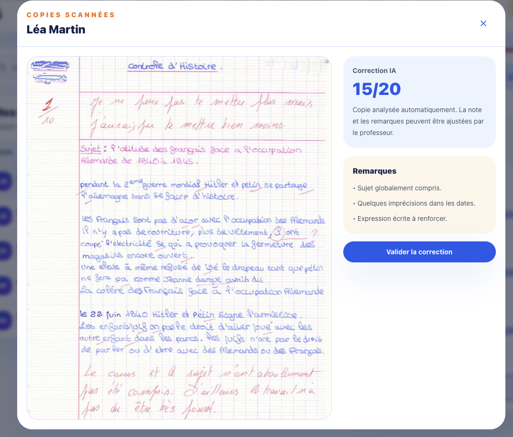

# TeachAndCorrect

TeachAndCorrect est une application web de correction assistée par intelligence
artificielle destinée aux enseignants.

L’objectif est de permettre à un professeur de transmettre une copie d’élève,
d’obtenir une proposition de correction et de note, puis de vérifier et valider
le résultat avant de le restituer à l’élève.

## État actuel du projet

La première version de l’interface frontend est en place.

Fonctionnalités actuellement disponibles :

- landing page de présentation ;
- navigation vers un dashboard de démonstration ;
- ouverture d’une modale d’inscription ;
- validation basique du formulaire d’inscription :
  - champs obligatoires ;
  - vérification simple du format de l’adresse email ;
  - confirmation du mot de passe ;
- affichage de données fictives concernant les élèves et leurs résultats ;
- affichage d’une copie et d’une proposition de correction simulée ;
- endpoint backend de vérification de disponibilité.

Ne sont pas encore implémentés :

- authentification et autorisation sécurisées ;
- création et persistance des comptes utilisateurs ;
- communication complète entre React et Spring Boot ;
- stockage PostgreSQL ;
- import réel des copies ;
- extraction du texte des copies ;
- intégration d’un modèle d’intelligence artificielle ;
- génération et validation réelle des corrections.

## Aperçu

### Landing page


### Inscription


### Dashboard professeur


### Proposition de correction



## Structure du projet

```text
TeachAndCorrect/
├── frontend/    # Application React, TypeScript et Vite
├── backend/     # API Spring Boot
├── docs/        # Documentation et captures d’écran
└── README.md
```

## Technologies

### Frontend

- React
- TypeScript
- Vite

### Backend

- Java
- Spring Boot
- Maven

### Technologies prévues pour le MVP

- PostgreSQL pour la persistance des données
- Spring Security pour l'authentification et les autorisations
- Une solution d'OCR ou un modèle multimodal pour analyser les copies
- Une API de modèle de langage pour générer une proposition de correction
- Docker pour faciliter l'exécution de l'application

## Installation

### Prérequis

Avant de lancer le projet, vérifiez que les outils suivants sont installés :

- Node.js
- npm
- Java
- Maven, ou utilisation du Maven Wrapper fourni avec le backend
- Git

### Cloner le dépôt

```bash
git clone https://github.com/gaelndb/TeachAndCorrect.git
cd TeachAndCorrect
```

## Lancer le frontend

Depuis la racine du projet :

```bash
cd frontend
npm install
npm run dev
```

L'application frontend est ensuite accessible à l'adresse indiquée par Vite,
généralement :

```text
http://localhost:5173
```

## Lancer le backend

Depuis la racine du projet :

```bash
cd backend
./mvnw spring-boot:run
```

Sous Windows :

```bash
cd backend
mvnw.cmd spring-boot:run
```

Le backend est ensuite accessible à l'adresse :

```text
http://localhost:8080
```

Endpoint de vérification :

```http
GET http://localhost:8080/api/health
```

## État actuel du projet

Le projet est actuellement en cours de développement.

À ce stade :

- la landing page est disponible ;
- le bouton de connexion permet d'accéder au dashboard de démonstration ;
- une modale d'inscription est disponible ;
- le formulaire vérifie que les champs obligatoires sont renseignés ;
- le format de l'adresse email fait l'objet d'une validation basique ;
- les mots de passe et leur confirmation doivent être identiques ;
- les données visibles dans le dashboard sont encore simulées ;
- l'authentification sécurisée n'est pas encore implémentée ;
- les comptes utilisateurs ne sont pas encore enregistrés en base de données ;
- l'intégration de l'OCR et du modèle d'intelligence artificielle reste à réaliser.

## Roadmap du MVP

- [x] Créer la structure du monorepo
- [x] Mettre en place le frontend React
- [x] Mettre en place le backend Spring Boot
- [x] Créer la landing page
- [x] Créer la modale d'inscription
- [x] Ajouter une validation frontend basique
- [x] Créer une première interface de dashboard
- [ ] Connecter le frontend à l'API Spring Boot
- [ ] Ajouter PostgreSQL
- [ ] Créer et enregistrer les comptes enseignants
- [ ] Mettre en place une authentification sécurisée
- [ ] Gérer les classes et les élèves
- [ ] Permettre l'import d'une copie
- [ ] Extraire le contenu d'une copie
- [ ] Générer une proposition de correction
- [ ] Permettre au professeur de modifier et valider la correction
- [ ] Enregistrer les devoirs, les copies et les résultats
- [ ] Ajouter des tests automatisés
- [ ] Conteneuriser l'application avec Docker
- [ ] Déployer une première version du MVP

## Vision du produit

TeachAndCorrect a pour objectif d'assister les enseignants dans la correction des
copies tout en conservant leur contrôle sur la décision finale.

L'intelligence artificielle doit proposer une correction, une appréciation et
éventuellement une note, mais ces éléments doivent rester modifiables et être
validés par le professeur avant d'être considérés comme définitifs.

Le projet vise également à permettre aux enseignants de centraliser les classes,
les élèves, les devoirs, les copies corrigées et certaines statistiques de suivi.

## Documentation

La documentation complémentaire du projet est disponible dans le dossier
[`docs/`](docs/).

Elle pourra notamment contenir :

- la documentation fonctionnelle ;
- la documentation technique ;
- les règles métier ;
- les diagrammes d'architecture ;
- le modèle de données ;
- les captures d'écran de l'application.

## Auteur

**Gaël Ndibodjo**

- LinkedIn : [linkedin.com/in/gael-ndibodjo](https://www.linkedin.com/in/gael-ndibodjo)
- GitHub : [github.com/gaelndb](https://github.com/gaelndb)
